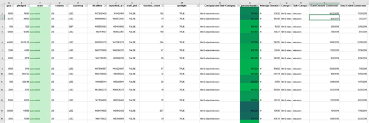
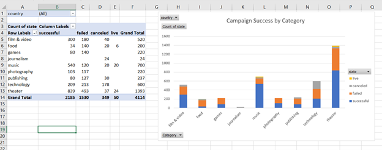
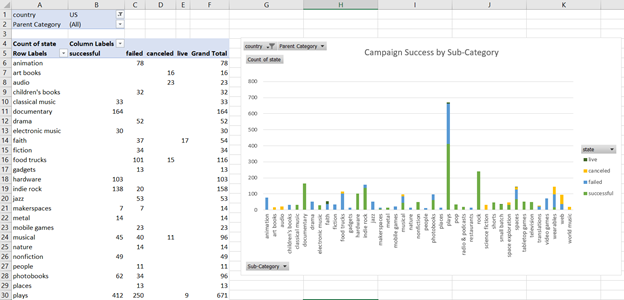
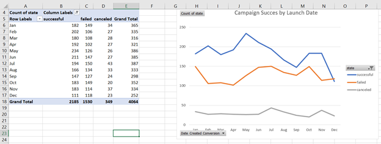
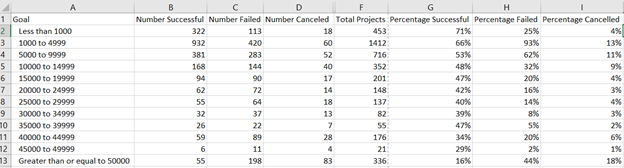
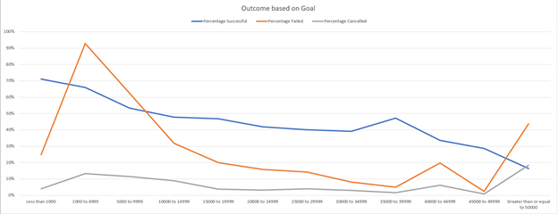

#### Background
Over $2 billion has been raised using the massively successful crowdfunding service, Kickstarter, but not every project has found success. Of the more than 300,000 projects launched on Kickstarter, only a third have made it through the funding process with a positive outcome.
Getting funded on Kickstarter requires meeting or exceeding the project's initial goal, so many organizations spend months looking through past projects in an attempt to discover some trick for finding success. For this week's homework, you will organize and analyze a database of 4,000 past projects in order to uncover any hidden trends.

#### Instructions
Using the Excel table provided, modify and analyze the data of 4,000 past Kickstarter projects as you attempt to uncover some market trends.

Using the Excel table provided, modify and analyze the data of 4,000 past Kickstarter projects as you attempt to uncover some market trends.

* Use conditional formatting to fill each cell in the state column with a different color, depending on whether the associated campaign was successful, failed, or canceled, or is currently live.

* Create a new column O called Percent Funded that uses a formula to uncover how much money a campaign made to reach its initial goal.

* Use conditional formatting to fill each cell in the Percent Funded column using a three-color scale. The scale should start at 0 and be a dark shade of red, transitioning to green at 100, and blue at 200.

* Create a new column P called Average Donation that uses a formula to uncover how much each backer for the project paid on average.

* Create two new columns, one called Category at Q and another called Sub-Category at R, which use formulas to split the Category and Sub-Category column into two parts.

* Create a new sheet with a pivot table that will analyze your initial worksheet to count how many campaigns were successful, failed, canceled, or are currently live per category.

* Create a stacked column pivot chart that can be filtered by country based on the table you have created.

* Create a new sheet with a pivot table that will analyze your initial sheet to count how many campaigns were successful, failed, or canceled, or are currently live per sub-category.

* Create a stacked column pivot chart that can be filtered by country and parent-category based on the table you have created.

* The dates stored within the deadline and launched_at columns use Unix timestamps. Fortunately for us, there is a formula that can be used to convert these timestamps to a normal date.

* Create a new column named Date Created Conversion that will use this formula to convert the data contained within launched_at into Excel's date format.

* Create a new column named Date Ended Conversion that will use this formula to convert the data contained within deadline into Excel's date format.

* Create a new sheet with a pivot table with a column of state, rows of Date Created Conversion, values based on the count of state, and filters based on parent category and Years.

* Now create a pivot chart line graph that visualizes this new table.

* Create a report in Microsoft Word and answer the following questions.

1. Given the provided data, what are three conclusions we can draw about Kickstarter campaigns?
2. What are some limitations of this dataset?
3. What are some other possible tables and/or graphs that we could create?

#### Bonus
* Create a new table with goal bins and count columns - see chart created below.

#### Conclusions
Based on the dataset provided, Kickstart campaigns were generally successful for the film & video, music, and theater categories.  Kickstart campaigns were not very successful for the food, games, photography, publishing, and technology categories.  The Kickstart campaigns were generally more successful in the United States and Great Britain where the largest number of campaigns were run.  

#### Data limitations for this dataset include the 
There are data entries that provide little information or are not defined, like “Spotlight” for example.  All successful campaigns show “TRUE” for this data field while failed, canceled, and live campaigns show “FALSE”.  It would be interesting to learn more about what the “Spotlight” field means and whether or not it predicts success.  Data fields like “name” and “blurb” are difficult to analyze using Excel.  The quality of these items may contribute to the success or failure of a campaign, but it is difficult to look at these fields when there are so many and each is unique and the quality of this content is subjective.  In addition, we lack detail regarding the demographics of the specific location of each campaign.  Beyond country and currency, culture, affluence, and population density would be a few additional parameters that may provide insight.  Perhaps the number of people each campaign reached could predict a campaign outcome – we have the number of backers but not the number of people who were solicited.  Regionally, perhaps different music genres are successful in one culture over another.  Finally, the canceled campaigns do not provide additional rationale as to why the campaign was canceled.  I would lean towards grouping the cancelation with failed campaigns but need more information, like why it was cancelled, to conclude this.

#### Additional Analysis
It would be beneficial to create a chart showing the relationship of campaign success and how many people donated to a campaign by looking at the number of backers compared to campaign success, failure, and cancelation.  To better assess the global information, a tool like Tableau would be useful in showing campaign concentration and success/failure/cancelation/live rates in countries represented on a map rather than looking at individual country data from a drop down filter.  

#### Bonus
The median more appropriately summarizes this dataset because there are outliers in the data that skew it.  The standard deviation is very high relative to the mean, indicating that there are data points differ from the mean significantly.  The median value is nearer to more datapoints than the mean. 
The median is captured from where most data points are concentrated, diminishing the skewing effects of outliers.  There is greater variability in the successful campaigns.  This is shown by the higher standard deviation for the successful campaign dataset.  This makes sense because a few of the successful campaigns had very large donations which offset the data, increasing its variability.  
